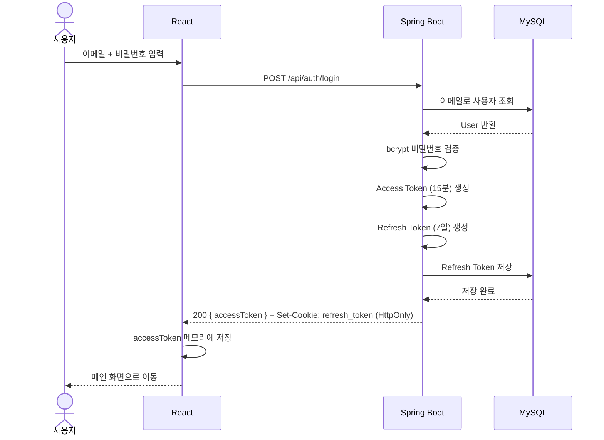
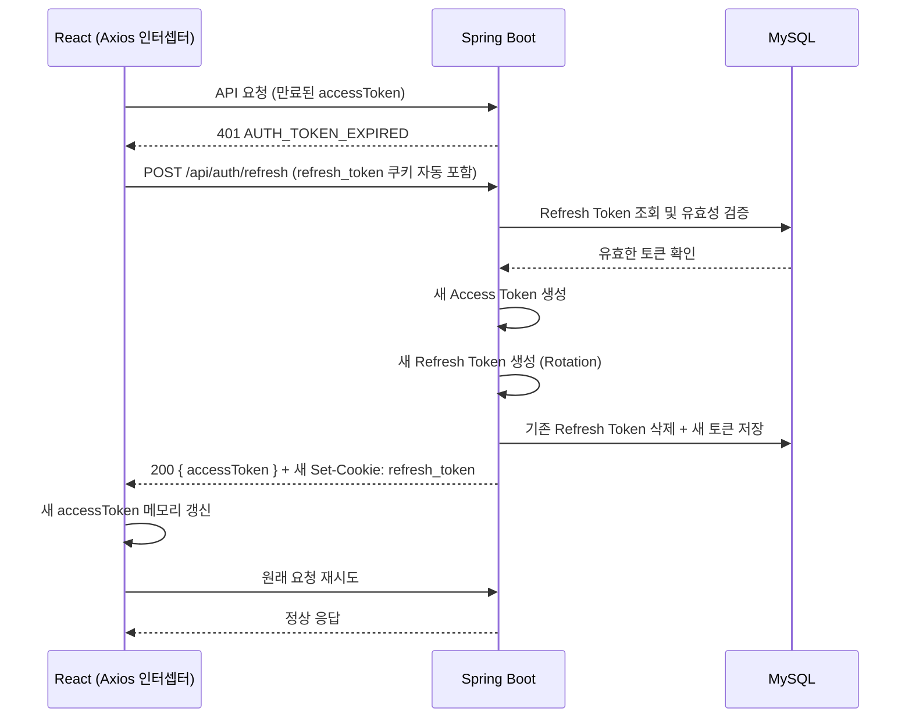
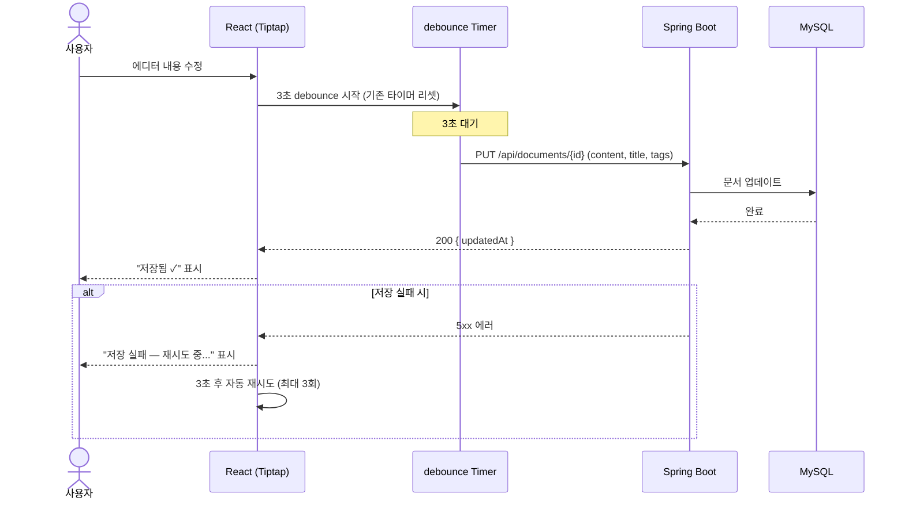
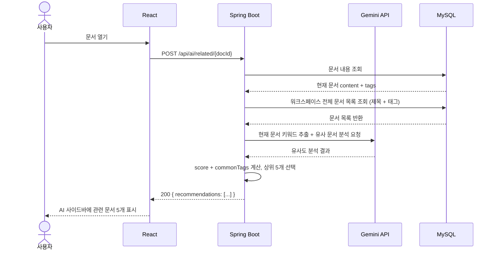
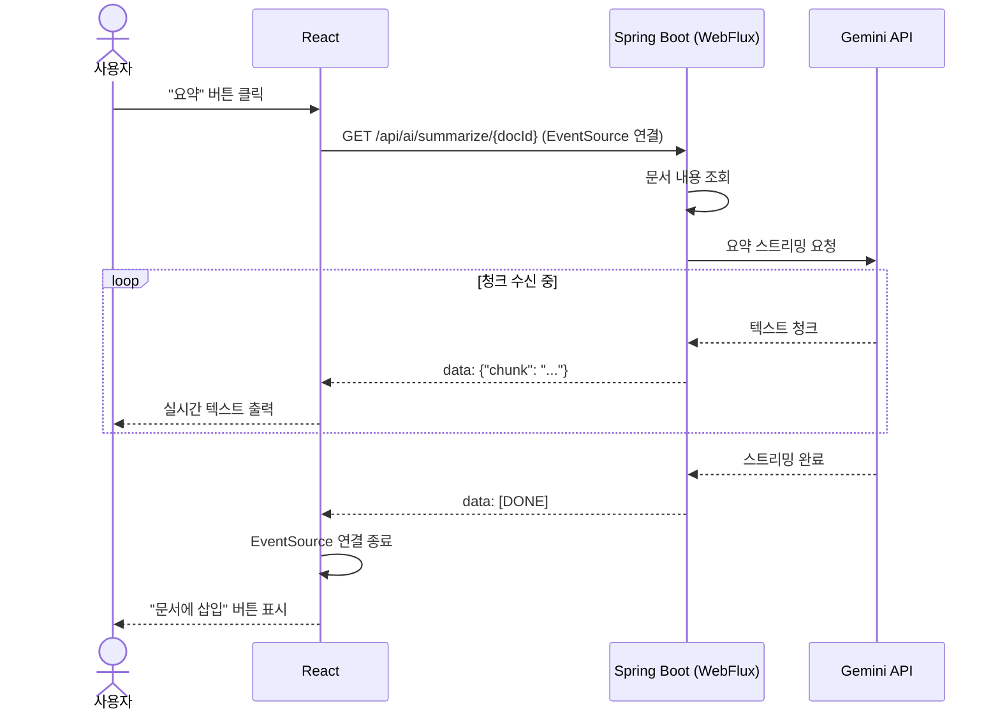

# devops-assist 아키텍처

> 버전: 0.2 | 작성일: 2026-02-27 | 상태: 초안

---

## 1. 전체 구조

```
┌─────────────────────────────────────────────────────┐
│                    Client (Browser)                   │
│                                                       │
│   React 19 + Vite                                     │
│   ┌──────────┐  ┌──────────┐  ┌──────────────────┐   │
│   │ 폴더 트리 │  │  에디터  │  │  AI 사이드바     │   │
│   │ (sidebar)│  │ (Tiptap) │  │  추천/요약/제안  │   │
│   └──────────┘  └──────────┘  └──────────────────┘   │
└─────────────────────────────────────────────────────┘
            │ REST API (JSON) + SSE (AI 스트리밍)
┌─────────────────────────────────────────────────────┐
│              Spring Boot 3.4.2 (Maven)                │
│                     port: 8080                        │
│                                                       │
│  ┌─────────────┐  ┌─────────────┐  ┌─────────────┐   │
│  │    Auth     │  │  Document   │  │  AI Service │   │
│  │  (JWT)      │  │  CRUD       │  │  (Gemini)   │   │
│  └─────────────┘  └─────────────┘  └─────────────┘   │
│                                                       │
│  ┌─────────────────────────────────────────────────┐  │
│  │          Spring Security Filter Chain           │  │
│  └─────────────────────────────────────────────────┘  │
└─────────────────────────────────────────────────────┘
            │ JPA / Hibernate
┌─────────────────────────────────────────────────────┐
│                      MySQL 8.x                        │
│   users | workspaces | documents | folders |          │
│   tags | document_tags | refresh_tokens               │
└─────────────────────────────────────────────────────┘
            │ REST API
┌─────────────────────────────────────────────────────┐
│              Gemini 2.5-flash API                     │
│   (GeminiService 패턴 — dev-agent에서 재사용)         │
└─────────────────────────────────────────────────────┘
```

---

## 2. 기술 스택

### Backend

| 항목 | 선택 | 이유 |
|------|------|------|
| Framework | Spring Boot 3.4.2 (Maven) | 기존 프로젝트 패턴 그대로 |
| Language | Java 21 | 기존 패턴 |
| ORM | Spring Data JPA + Hibernate | 기존 패턴 |
| DB | MySQL 8.x | 영구 저장, 다중 사용자 |
| Auth | JWT (Access + Refresh) + Spring Security | TableQ 패턴 참조 |
| AI | Gemini 2.5-flash | dev-agent GeminiService 재사용 |
| Streaming | SSE (Server-Sent Events) | dev-agent WebFlux SSE 패턴 재사용 |

### Frontend

| 항목 | 선택 | 이유 |
|------|------|------|
| Framework | React 19 + Vite | 블록 에디터 구현에 적합 |
| 에디터 | Tiptap v2 | 블록 기반, 확장성 좋음, MIT |
| 상태관리 | Zustand | 경량, 간단한 구조 |
| HTTP | Axios | 기존 React 프로젝트 패턴 |
| 스타일 | Tailwind CSS | 빠른 UI 구성 |

> **왜 Thymeleaf 아닌 React?**
> 블록 기반 리치 텍스트 에디터(Notion 스타일)는 복잡한 클라이언트 상태를 다뤄야 하므로 React가 필수적.
> Thymeleaf는 Phase B/C의 분석 대시보드용으로 고려 가능.

---

## 3. 데이터베이스 스키마 (초안)

```sql
-- 사용자
users
  id            BIGINT PK AUTO_INCREMENT
  email         VARCHAR(255) UNIQUE NOT NULL
  password      VARCHAR(255) NOT NULL          -- bcrypt
  username      VARCHAR(100) NOT NULL
  created_at    DATETIME

-- Refresh Token
refresh_tokens
  id            BIGINT PK AUTO_INCREMENT
  user_id       BIGINT FK(users.id)
  token         VARCHAR(512) UNIQUE NOT NULL
  expires_at    DATETIME
  created_at    DATETIME

-- 워크스페이스 (현재 1:1 user, Phase B 확장 고려)
workspaces
  id            BIGINT PK AUTO_INCREMENT
  user_id       BIGINT FK(users.id)
  name          VARCHAR(100) NOT NULL
  created_at    DATETIME

-- 폴더
folders
  id            BIGINT PK AUTO_INCREMENT
  workspace_id  BIGINT FK(workspaces.id)
  parent_id     BIGINT FK(folders.id) NULL    -- 루트면 NULL
  name          VARCHAR(100) NOT NULL
  order_index   INT DEFAULT 0
  created_at    DATETIME

-- 문서
documents
  id            BIGINT PK AUTO_INCREMENT
  workspace_id  BIGINT FK(workspaces.id)
  folder_id     BIGINT FK(folders.id) NULL    -- 미분류면 NULL
  title         VARCHAR(500) NOT NULL DEFAULT '제목 없음'
  content       LONGTEXT                       -- Tiptap JSON
  is_favorited  BOOLEAN DEFAULT FALSE
  created_at    DATETIME
  updated_at    DATETIME

-- 태그
tags
  id            BIGINT PK AUTO_INCREMENT
  workspace_id  BIGINT FK(workspaces.id)
  name          VARCHAR(100) NOT NULL
  UNIQUE(workspace_id, name)

-- 문서-태그 연결
document_tags
  document_id   BIGINT FK(documents.id)
  tag_id        BIGINT FK(tags.id)
  PRIMARY KEY(document_id, tag_id)
```

---

## 4. API 엔드포인트 (초안)

### 인증
```
POST   /api/auth/signup           회원가입
POST   /api/auth/login            로그인 → JWT 발급
POST   /api/auth/refresh          Access Token 재발급
POST   /api/auth/logout           Refresh Token 무효화
```

### 문서
```
GET    /api/documents             워크스페이스 문서 목록
POST   /api/documents             문서 생성
GET    /api/documents/{id}        문서 조회
PUT    /api/documents/{id}        문서 수정 (자동저장 포함)
DELETE /api/documents/{id}        문서 삭제
PATCH  /api/documents/{id}/move   폴더 이동
```

### 폴더
```
GET    /api/folders               폴더 트리 조회
POST   /api/folders               폴더 생성
PUT    /api/folders/{id}          폴더 이름 변경
DELETE /api/folders/{id}          폴더 삭제
```

### 태그
```
GET    /api/tags                  태그 목록 조회
PUT    /api/tags/{id}             태그 이름 변경
DELETE /api/tags/{id}             태그 삭제
```

### AI
```
POST   /api/ai/related/{docId}    관련 문서 추천 (JSON)
GET    /api/ai/summarize/{docId}  문서 요약 (SSE 스트리밍)
GET    /api/ai/suggest/{docId}    보완 제안 (SSE 스트리밍)
POST   /api/ai/search             자연어 검색 (Phase A 후반)
POST   /api/ai/tags/{docId}       태그 자동 제안 (Phase A 후반)
```

---

## 5. 프로젝트 폴더 구조

```
devops-assist/
├── src/
│   ├── main/
│   │   ├── java/com/devops/assist/
│   │   │   ├── auth/             # JWT, Security 설정
│   │   │   ├── user/             # User 엔티티, 서비스
│   │   │   ├── workspace/        # Workspace
│   │   │   ├── document/         # Document, Folder, Tag
│   │   │   ├── ai/               # GeminiService, AI 엔드포인트
│   │   │   └── common/           # 공통 응답, 예외처리
│   │   └── resources/
│   │       ├── application.properties
│   │       └── static/           # React 빌드 산출물 위치
├── frontend/                     # React 19 + Vite
│   ├── src/
│   │   ├── components/
│   │   │   ├── editor/           # Tiptap 에디터 관련
│   │   │   ├── sidebar/          # 폴더 트리
│   │   │   └── ai/               # AI 패널
│   │   ├── pages/
│   │   ├── stores/               # Zustand
│   │   └── api/                  # Axios 인스턴스
│   └── vite.config.js
├── docs/
│   ├── 기능_요구서.md
│   ├── 아키텍처.md
│   └── 설계서.md
└── pom.xml
```

---

## 6. 배포 전략 (Phase A — 확정)

> 로컬 MySQL + 포트포워딩으로 확정 (설계서 10절 참조)


```
로컬 개발
  - Backend: ./mvnw.cmd spring-boot:run (port 8080)
  - Frontend: npm run dev (port 5173, proxy → 8080)

배포
  - React 빌드 → src/main/resources/static/ 복사
  - Spring Boot 단일 JAR로 배포
  - 외부 테스터용: 포트포워딩
```

---

## 7. 시퀀스 다이어그램

### 7.1 로그인



### 7.2 Access Token 재발급



### 7.3 자동 저장



### 7.4 AI 관련 문서 추천



### 7.5 AI 요약 (SSE 스트리밍)


